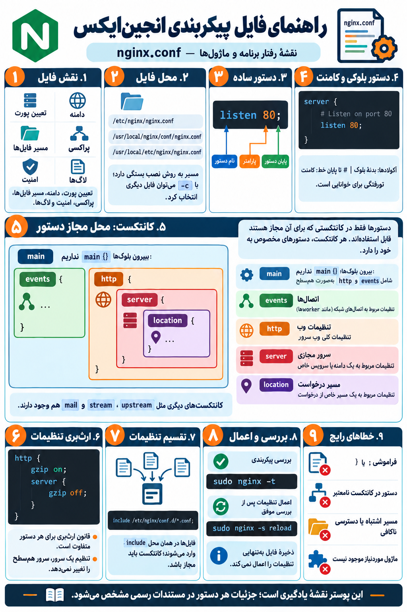

# intro to nginx.conf
---
## چی قراره بخونیم درون این فولدر 
- یه عکس اماده کردم از محتوا این فولدر ولی محدود به این ها نیست و چیزایه بیشتری میزارم تو یه این فولد چون فایل پیکربندی nginx.conf خیلی مهمه ولی چکیدش اینه مطالبی که باید بدونید.

	

---
## و بخوام کله چیزایی که باید درمورد فایل پیکربندی رو بدونید لیست کنم شامل اینا میشه
- نقش فایل `nginx.conf`
- مسیر فایل و تفاوت روش‌های نصب
- انتخاب فایل پیکربندی با گزینهٔ `-c`
- ساختار و قواعد نوشتن پیکربندی
- دستور ساده (simple directive)
- دستور بلوکی (block directive)
- نام دستور و پارامترهای آن
- نقطه‌ویرگول `;` و آکولادها `{ }`
- کامنت با `#`
- فاصله‌ها، تورفتگی و نقل‌قول‌ها
- متغیرها و علامت `$`
- کانتکست اصلی (`main`)
- کانتکست `events`
- کانتکست `http`
- کانتکست `server`
- کانتکست `location`
- کانتکست `upstream`
- کانتکست‌های `stream` و `mail`
- محل مجاز هر دستور
- رابطهٔ کانتکست‌های تو‌در‌تو
- ارث‌بری، بازنویسی و ادغام تنظیمات
- مقادیر پیش‌فرض دستورها
- واحدهای زمان و اندازه
- تقسیم تنظیمات با `include`
- مسیرهای نسبی و مطلق
- ماژول‌ها و دستورهای وابسته به آن‌ها
- بارگذاری ماژول‌های پویا با `load_module`
- تنظیم پردازش‌های کاری و اتصال‌ها
- تنظیم پورت و آدرس با `listen`
- نام دامنه با `server_name`
- سرور پیش‌فرض با `default_server`
- قواعد انتخاب بلوک `server`
- انواع و اولویت تطبیق `location`
- ارائهٔ فایل‌ها با `root` و `alias`
- صفحهٔ پیش‌فرض با `index`
- بررسی فایل‌ها با `try_files`
- نوع محتوا با `types` و `default_type`
- پراکسی معکوس با `proxy_pass`
- تنظیم هدرهای پراکسی
- اتصال به FastCGI با `fastcgi_pass`
- توزیع بار و تنظیم `upstream`
- تنظیم HTTPS و گواهی‌های TLS
- تغییر مسیر با `return` و `rewrite`
- پردازش خطاها با `error_page`
- ثبت درخواست‌ها و خطاها
- قالب لاگ با `log_format`
- محدودیت حجم بدنهٔ درخواست
- زمان‌های انتظار، بافرها و اتصال پایدار
- فشرده‌سازی پاسخ‌ها
- کش و تنظیم انقضای محتوا
- هدرهای پاسخ و قواعد ارث‌بری آن‌ها
- محدودکردن دسترسی، نرخ درخواست و تعداد اتصال
- احراز هویت
- نگاشت متغیرها با `map`
- بررسی پیکربندی با `nginx -t`
- نمایش پیکربندی کامل با `nginx -T`
- مشاهدهٔ مشخصات ساخت با `nginx -V`
- اعمال تنظیمات با `reload`
- تفاوت `reload` و `restart`
- رفتار پردازش‌ها هنگام بارگذاری مجدد
- خطاهای نحوی، مسیرها و مجوزهای دسترسی
- پشتیبان‌گیری و مدیریت نسخهٔ تنظیمات
- مراجعه به مستندات رسمی هر دستور
